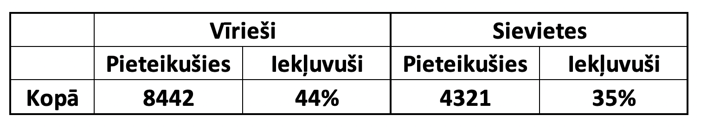
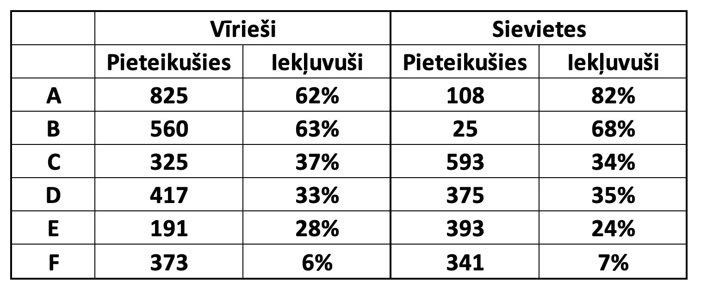

```{r xaringan-themer, include = FALSE}
library(xaringanthemer)
mono_accent(
  base_color = "#43418A",
  text_font_size = "25px",
  text_slide_number_font_size = "0.5em",
  header_font_family = "Times New Roman",
  text_font_family = "Times New Roman",
  outfile = "xaringan-themer.css"
)
options(htmltools.dir.version = FALSE)
```
```{r setup, include=FALSE}
knitr::opts_chunk$set(fig.height = 4.5, fig.width = 8, dev='svg', echo = TRUE, message = FALSE, warning = FALSE)
```


class: inverse, middle, center
# Statistika

---
## Statistika

.defin[
Statistikas metodes ir rīki domāšanai ... nevis domāšanas aizstājēji!
]

/Abrahm Kaplan/


---
## Kāda ir saistība?

```{r, fig.align='center', echo=FALSE}
library(dplyr)
library(scales)
library(ggplot2)
library(cowplot)
theme_set(theme_cowplot())
set.seed(123)
n = 1000

Education = rbinom(n, 2, 0.5)
Neuroticism = rnorm(n) + Education
Salary = Education * 2 + rnorm(n) - Neuroticism * 0.3

Salary = sample(10000:11000,1) + rescale(Salary, to = c(0, 100000))
# summary(Salary)
Neuroticism = rescale(Neuroticism, to = c(0, 7))
# summary(Neuroticism)
Education = factor(Education, labels = c("Low", "Medium", "High"))

data <- data.frame(
  Salary,
  Neuroticism,
  Education
)

p <- data %>% ggplot(.,aes(Neuroticism, Salary)) 
p + geom_point(alpha = 0.5) + geom_smooth(method = 'lm') +
      labs(x = "Neirotisms", y = "Alga") +
  theme_xaringan()
```

.izm50[
Avots: http://rpubs.com/lakenp/simpsonsparadox
]


---
## Kāda ir saistība?


Uzņemšanas statistika Kalifornijas Universitātē 1973. gadā

.center[

]

.izm50[
Avots: https://en.wikipedia.org/wiki/Simpson%27s_paradox
]


---
## Kāda ir saistība?

**Simpsona paradokss**

Uzņemšanas statistika Kalifornijas Universitātē 1973. gadā, dalījums departamentos.

.center[

]

.izm50[
Avots: https://en.wikipedia.org/wiki/Simpson%27s_paradox
]


---
## Kāda ir saistība?

Simpsona paradokss

```{r, fig.height=4.0, fig.align="center", echo=FALSE}
p + geom_point(aes(color = Education)) + geom_smooth(aes(color = Education),method = 'lm') +
      labs(x = "Neirotisms", y = "Alga") +
      scale_xaringan_color_discrete("Izglītības\nlīmenis", labels = c("Zems", "Vidējs", "Augsts")) +
  theme_xaringan() +
  theme(legend.title = element_text(size = rel(0.8)),
        legend.text = element_text(size = rel(0.65)))
```

.izm50[
Avots: http://rpubs.com/lakenp/simpsonsparadox
]


---
## Biometrija

.defin[
Statistisko metožu kopums, kuru lieto bioloģiskās informācijas ievākšanā, apstrādē un interpretācijā
]

<br>

.defin[
Statistisko metožu pielietošana bioloģijas problēmu risināšanā
]

---
## Kas ir statistika?

Statistika ir zinātne ("māksla") mācīties no datiem.

Statistika ir zinātne/disciplīna, kas ir saistīta ar:

* eksperimentu un datu iegūšanas dizainu;

* iegūtās informācijas apkopošanu;

* secinājumu izdarīšanu balstoties uz datiem;

* tagadnes novērtēšanu un nākotnes prognozēšanu.

---
## Kāpēc jāmācās statistika?

* Zinātnes sarežģītības un daudzveidības dēļ.

* Rezultātiem vajag vispārinājumu.

* Ir jāzina statistikas pamatprincipi, lai varētu konsultēties, saprast publikācijās rakstīto.

* Statistiķis (datu analītiķis) šobrīd un tuvākajā nākotnē tiek iekļauts pieprasītāko profesiju sarakstā.

---
## Statistikas veidi

.defin[
**Aprakstošā statistika** – iekļauj metodes, lai organizētu, grafiski attēlotu un apkopotu informāciju par paraugkopu vai populāciju.
]

<br>

.defin[
**Secinošā (inferential) statistika** – iekļauj metodes, kas izmanto paraugkopu informāciju, lai izdarītu secinājumus par visu populāciju.
]

---
class: inverse, middle, center
# Pazīmes un dati

---
## Pazīmes

**Indivīdi** - objekti, kas iekļauti pētījumā

**Pazīmes** - objektu īpašības vai iezīmes, kas tiek
izraudzītas turpmākai izzināšanai

Pētnieku interesē pazīmes, kurām raksturīga mainība jeb variācija

---
## Populācija un paraugkopa

.defin[
**Populācija jeb ģenerālkopa** – aptver visus iespējamos interesējošos indivīdus.
]
<br>
.defin[
**Paraugkopa jeb izlase** – daļa no populācijas, kas tiek aptverta konkrētajā pētījumā.
]
---
## Populācija un paraugkopa

.defin[
**Parametrs** – skaitlisks mērījums, kas raksturo kādu populācijas aspektu.
]

<br>

.defin[
**Statistiskais rādītājs** – skaitlisks mērījums, kas raksturo kādu paraugkopas aspektu.
]

---
## Pazīmes

* Konstantās un nejauši variējošās

* Kvantitatīvas
      - Diskrētas
      - Nepārtrauktas

* Kvalitatīvas
      - Alternatīvas
      - Nealternatīvas

---
## Kvantitatīvas pazīmes

.defin[
**Kvantitatīvas pazīmes** – raksturo indivīdu īpašības, ko iegūst skaitīšanas vai ”mērīšanas” rezultātā
]

**Diskrētas pazīmes** – vērtības iegūst skaitīšanas rezultātā (ribu skaits, izdēto olu skaits, mazuļu skaits)

**Nepārtraukti variējošas pazīmes** – iegūst ”mērīšanas” rezultātā (augu garums, nitrātu koncentrācija, patērētais laiks)

---
## Kvalitatīvas pazīmes

.defin[
**Kvalitatīvas pazīmes** – raksturo indivīda/procesa īpašības, ko var izteikt kā esamību vai neesamību, vai iedalīt kādā konkrētā grupā
]

**Alternatīvi variējošas** – rezultāti parāda pazīmes klātbūtni vai iztrūkumu (augs zied vai nezied, ārstnieciskais preparāts iedarbojas vai neiedarbojas)

**Nealternatīvi variējošas** – pazīmes iedala vairākās kvalitatīvās grupās (zieda krāsa (dzeltena, sarkana, zila, balta))

---
## Datu piemērs

Pētījums par āboliem eksperimentālos laukos.

--
- Āboli => Objekti
--

- Ābolu svars =>
--

- Ābolu svars => Pazīme
--

- Svars => 
--

- Svars => Kvantitatīva nepārtraukti variējoša pazīme
--

- Pētījumā iekļauti visi āboli laukā => 
--

- Pētījumā iekļauti visi āboli laukā => Populācija
--

- Vidējais svars visiem āboliem =>
--

- Vidējais svars visiem āboliem => Parametrs

---
## Datu piemērs

Pētījums par tiem pašiem āboliem eksperimentālos laukos.

--
- Āboli => Objekti
--

- Ābolu garša (salds, saldskābs, skābs) => 
--

- Ābolu garša (salds, saldskābs, skābs) => Pazīme
--

- Garša => 
--

- Garša => Kvalitatīva nealternatīvi variējoša pazīme
--

- Pētījumā iekļauta puse ābolu laukā => 
--

- Pētījumā iekļauta puse ābolu laukā => Paraugkopa
--

- Saldo ābolu īpatsvars => 
--

- Saldo ābolu īpatsvars => Statistiskais rādītājs

---
## Datu veidi

- **Nomināli dati (nominal)** - attiecas uz datiem, kas sastāv no
vārdiem, kategorijām. Šos datus nevar sagrupēt no mazākā uz
lielāko
--


- **Kārtas dati (ordinal)** – attiecas uz datiem, kurus var sakārtot
pieaugošā secībā, bet starpību starp vienībām nevar noteikt vai tā
neko neizsaka
--

- **Intervāla dati (interval)** – attiecas uz datiem, kurus var sakārtot
pieaugošā secībā, turklāt starpības starp datu vienībām ir jēgpilpa
--


- **Skalārie jeb proporcijas dati (ratio)** – attiecas uz datiem, kurus
var sakārtot pieaugošā secībā, turklāt gan starpība starp datu
vienībām, gan arī proporcija starp datu vienībām ir jēgpilna. Šādi
dati satur patieso nulli

---
## Datu veidi

--
- Jānis, Pēteris, Ieva
--


- Piekrītu, daļēji piekrītu, nepiekrītu
--


- Gaisa temperatūra (Celsiju grādos)
--


- Metāla kušas temperatūra (Kelvina grādos)
--


- Laša garums (cm)
--


- Dzimšanas gads

---
## Nejaušs paraugs

.defin[
**Vienkāršs nejaušs (random) paraugs**, kas sastāv no **n**
populācijas mērījumiem, ir populācijas daļa, kas izvēlēta tādā
veidā, ka katram **n** izmēra paraugam no populācijas ir vienāda
iespēja tikt izvēlētam.
]

Vienkārša nejauša parauga gadījumā vienāda iespēja tikt izvēlētam
ir ne tikai jebkuram n izmēra paraugam, bet arī katram populācijas
indivīdam ir vienāda iespēja tikt izvēlētam.

---
## Nejaušs paraugs

Loterijā ir jāizvēlas 5 skaitļi no 36. Vinnē tas, kura izvēlētie skaitļi
sakrīt ar uzvarējušiem pieciem skaitļiem.

--
- Vai skaitlim 3 ir tik pat liela iespēja būt starp vinnējošiem skaitļiem kā 34?
--


- Vai visi vinnējošie skaitļi varētu būt nepāra skaitļi?
--


- Vai ir iespējams vinnēt loterijā, ja katrā izvēlas skaitļus 31, 32, 33, 34 un 35?


---
class: inverse, middle, center
# Empīriskie sadalījumi

---
## Empīriskie sadalījumi

**Frekvenču tabula** sadala datus klasēs vai intervālos un parāda cik
daudz novērojumu ir katrā no klasēm.

---
## Empīriskie sadalījumi

1. Nesakārtotu skaitļu masa

2. Varianšu grupēšana

3. Pazīmju vērtību rinda un šo vērtību atkārtošanās biežumus jeb frekvences

4. Empīriskais sadalījums

---
## Empīriskie sadalījumi

**Klase** – kategorija datu grupēšanai

**Frekvence** – novērojumu skaits konkrētajā klasē

**Relatīvā frekvence** – parāda cik lielu daļu no visiem novērojumiem
aizņem konkrētā klase (Frekvence/Kopējais novērojumu skaits)

**Kumulatīvā frekvence** – parāda cik novērojumu ir līdz konkrētajā
klasei to ieskaitot

---
## Empīriskie sadalījumi - diskrēti dati


6| 7| 7| 7| 1
-|--|--|--|--
5| 6| 6| 5| 2
7| 7| 3| 6| 7
3| 5| 3| 7| 5
1| 2| 2| 7| 5

---
## Empīriskie sadalījumi - diskrēti dati


1| 1| 2| 2| 2
-|--|--|--|--
3| 3| 3| 5| 5
5| 5| 5| 6| 6
6| 6| 7| 7| 7
7| 7| 7| 7| 7

---
## Empīriskie sadalījumi - diskrēti dati

Vērtība| Frekvence| Relatīvā frekvence| Kumulatīvā frekvence
-|--|--|--
1| 2| 0,08| 2
2| 3| 0,12| 5
3| 3| 0,12| 8
4| 0| 0,00| 8
5| 5| 0,20| 13
6| 4| 0,16| 17
7| 8| 0,32| 25
Kopā| 25| 1| 

---
## Empīriskie sadalījumi

```{r,echo=FALSE, fig.align="center"}
library(ggplot2)
library(cowplot)
theme_set(theme_cowplot())
tema <- theme(text = element_text(face = "bold", size = 20))
df <- data.frame(x = factor(1:7),
                 y = c(2,3,3,0.01,5,4,8))
ggplot(df, aes(x,y)) + 
  geom_col() +
  tema +
  labs(x = "Klase", y = "Frekvence") +
  theme_xaringan()
  
```

---
## Empīriskie sadalījumi - nepārtraukti variējoši dati

151.0| 151.5| 153.0| 153.5| 154.5| 155.5| 156.5| 157.5| 158.0| 158.5
-|--|--|--|--|--|--|--|--|--
159.0| 159.5| 160.0| 160.5| 161.0| 161.5| 162.0| 163.5| 164.0| 164.5
165.0| 165.5| 166.5| 168.0| 168.5| 169.0| 169.5| 170.0| 171.0| 171.5
172.0| 173.0| 173.5| 175.0| 175.5| 176.5| 178.0| 179.0| 180.0| 182.0
183.0| 183.5| 184.5| 185.0| 185.5| 186.5| 188.0| 188.5| 189.0| 189.9

---
## Empīriskie sadalījumi - nepārtraukti variējoši dati

.izm75[
Klases|Klases|Klases|Frekvence|Relatīvā|Kumulatīvā
-|--|--|--|--|--
minimālā |maksimālā|vidējā||frekvence|frekvence
robeža|robeža|vērtība||| 
150|154,9|152,45|5|0,10|5
155|159,9|157,45|7|0,14|12
160|164,9|162,45|8|0,16|20
165|169,9|167,45|7|0,14|27
170|174,9|172,45|6|0,12|33
175|179,9|177,45|5|0,10|38
180|184,9|182,45|5|0,10|43
185|189,9|187,45|7|0,14|50
Kopā|||50|1|]

---
## Empīriskie sadalījumi - histogramma

```{r,echo=FALSE,warning=FALSE, fig.align="center"}
df <- data.frame(x = c(151.0, 151.5, 153.0, 153.5, 154.5, 155.5, 156.5, 157.5, 158.0, 158.5,
159.0, 159.5, 160.0, 160.5, 161.0, 161.5, 162.0, 163.5, 164.0, 164.5,
165.0, 165.5, 166.5, 168.0, 168.5, 169.0, 169.5, 170.0, 171.0, 171.5,
172.0, 173.0, 173.5, 175.0, 175.5, 176.5, 178.0, 179.0, 180.0, 182.0,
183.0, 183.5, 184.5, 185.0, 185.5, 186.5, 188.0, 188.5, 189.0, 189.9))
ggplot(df, aes(x)) + geom_histogram(breaks = seq(150,190,5)) +
  labs(x = "Klašu vērtības", y = "Frekvence") +
  tema +
  theme_xaringan()
```

---
## Empīriskie sadalījumi – kumulatīvo frekvenču līkne

```{r,echo=FALSE,warning=FALSE, fig.align="center"}
df <- data.frame(x = seq(152.45,187.45,5),
                 y = c(5,12,20,27,33,38,43,50))

ggplot(df, aes(x, y)) + geom_line(size = 1.2) +
  geom_point(size = 3) + tema +
  scale_x_continuous(breaks = df$x) +
  labs(x = "Klašu vidējās vērtības", y = "Kumulatīvā frekvence") +
  theme_xaringan()
```

---
class: center, inverse, middle
# Kādi būtu jautājumi?