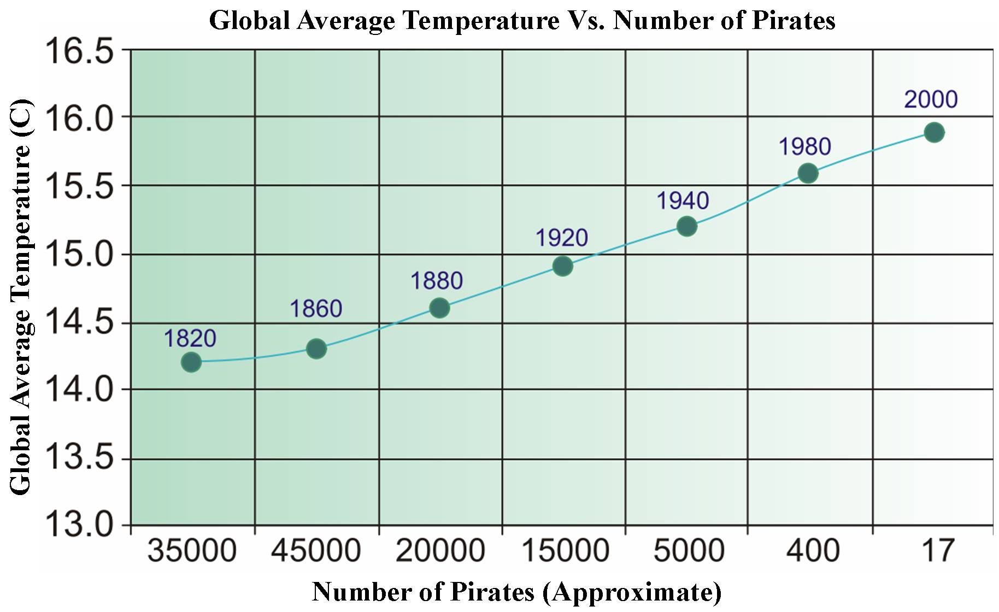
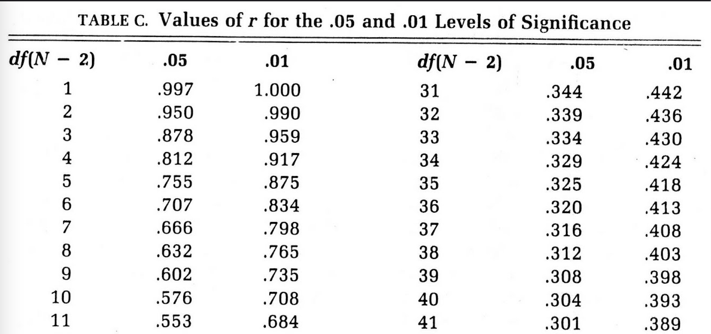
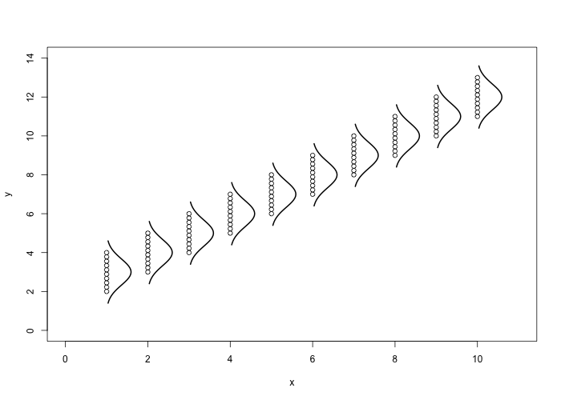
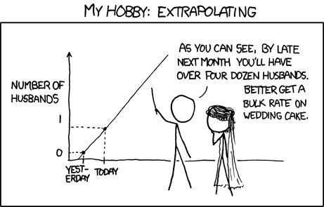

```{r xaringan-themer, include = FALSE}
library(xaringanthemer)
mono_accent(
  base_color = "#43418A",
  text_font_size = "25px",
  text_slide_number_font_size = "0.5em",
  outfile = "xaringan-themer.css"
)
options(htmltools.dir.version = FALSE)
```
```{r setup, include=FALSE}
knitr::opts_chunk$set(fig.height = 4.5, fig.width = 8, dev='svg', message = FALSE, fig.align = "center")
```


class: center, inverse, middle
# Korelācijas analīze


---
## Korelācijas analīze

Atbildāmie jautājumi:

* Vai ir saistība starp cilvēka garumu un viņa svaru?

* Vai ir saistība starp koku ikgadējo pieaugumu un gaisa temperatūru?

* Vai ir saistība starp kokaudzes vecumu un reto sugu daudzumu tajā?

* Vai ir saistība starp precētu cilvēku holesterīna līmeņiem?


---
## Korelācijas analīze

.defin[
**Korelācijas koeficients** (r) rāda atkarības veidu, virzienu un kvantitatīvi raksturo pazīmju savstarpēju ciešumu. 
]

Lai aprēķinātu korelācijas koeficientu, ir nepieciešami saistīti dati par divām pazīmēm.

---
## Korelācijas analīze

Korelācijas analīžu veidi:

* Pīrsona korelācijas analīze

* Rangu korelācija - Spirmena un Kendela

* Autokorelācija

---
## Korelācijas analīze

.defin[
Korelācijas koeficients (r) ir skaitliska vērtība, kas novērtē lineāro saistību starp diviem mainīgajiem x un y.
]
<br>
.defin[
**Pozitīva korelācija** ir tad, kad mazas x vērtības ir saistītas ar mazām y vērtībām un lielas x vērtības ir saistītas ar lielām y vērtībām.
]
<br>
.defin[
**Negatīva korelācija** ir tad, kad mazas x vērtības ir saistītas ar lielām y vērtībām un lielas x vērtības ir saistītas ar mazām y vērtībām. 
]
---
## Pozitīva korelācija

```{r 5l_pozkor,echo=FALSE,fig.align='center',warning=FALSE}
library(ggplot2)
library(grid)
x<-1:20
y<-2*x+rnorm(20,0,7)

df<-data.frame(x,y)
ggplot(df,aes(x,y))+geom_point(size=5)+
  theme_bw()+
  theme(axis.title=element_text(size=rel(1.8),face="bold"),
        axis.text=element_text(color="black",size=rel(1.5)),
        panel.grid=element_blank(),
        legend.position="top",
        legend.text=element_text(size=rel(1.8),face="bold"),
        legend.key=element_blank(),
        legend.key.width=unit(2,"cm"),
        legend.title=element_blank())
```

---
## Negatīva korelācija

```{r 5l_negkor,echo=FALSE,fig.align='center',warning=FALSE}

x<-1:20
y<-50+-2*x+rnorm(20,0,7)

df<-data.frame(x,y)
ggplot(df,aes(x,y))+geom_point(size=5)+
  theme_bw()+
  theme(axis.title=element_text(size=rel(1.8),face="bold"),
        axis.text=element_text(color="black",size=rel(1.5)),
        panel.grid=element_blank(),
        legend.position="top",
        legend.text=element_text(size=rel(1.8),face="bold"),
        legend.key=element_blank(),
        legend.key.width=unit(2,"cm"),
        legend.title=element_blank())
```

---
## Korelācijas analīze

Korelācijas koeficienta raksturojums:

* r ir skaitlis bez mērvienības robežās no -1 līdz +1

* r vērtība nemainās neatkarīgi no tā, kurš no diviem mainīgajiem tiek uztverts kā x un kurš kā y

* r vērtība nemainās, ja kādam vai abiem no mainīgajiem tiek mainītas mērvienības

---
## Korelācijas piemērs

.center[]

.izm50[
Avots: http://en.wikipedia.org/wiki/File\%3aPiratesVsTemp\_English.jpg
]
---
## Korelācijas analīze

.defin[
Statistiski būtiska korelācija automātiski **nenozīmē**, ka viena pazīme **ietekmē** otru pazīmi! Tā var vienkārši būt **sakritība**!
]

---
## Korelācijas piemērs

Daudz piemēru ar it kā būtiskiem korelācijas koeficientiem. Bet vai tiešām tur ir kāda saistība??

http://www.tylervigen.com/

---
## Grafiskā analīze

```{r 5l_korprob,echo=FALSE,fig.align='center',warning=FALSE}
set.seed(123)
df<-data.frame(x=rnorm(50),y=rnorm(50))
df[1,1]<- -2.4
df[1,2]<- 6.2
ggplot(df,aes(x,y))+geom_point(size=5)+
  theme_bw()+
  theme(axis.title=element_text(size=rel(1.8),face="bold"),
        axis.text=element_text(color="black",size=rel(1.5)),
        panel.grid=element_blank(),
        legend.position="top",
        legend.text=element_text(size=rel(1.8),face="bold"),
        legend.key=element_blank(),
        legend.key.width=unit(2,"cm"),
        legend.title=element_blank())
```

---
## Pīrsona korelācijas koeficients

.izm90[
Priekšnosacījums:

* Abu paraugkopu dati nāk no populācijām, kuru sadalījumi **atbilst normālajam sadalījumam**


$$
r=\frac{\sum\limits_{i=1}^n x_i y_i-\overline{x}\cdot \overline{y}\cdot n}{(n-1)\cdot s_x\cdot s_y}
$$
kur n - x, y  paraugkopas apjoms ( $n_x$ = $n_y$= n)

$s_x$, $s_y$ - x, y paraugkopas standartnovirze

$\overline{x}$, $\overline{y}$ - x, y paraugkopas vidējais aritmētiskais

$x_i$, $y_i$ - x, y paraugkopas i-tās vērtības
]

---
## Pīrsona korelācijas koeficients

Lai pārbaudītu Nulles hipotēzi $H_0:\rho=0$ pret $H_1:\rho \neq 0$ (kur $\rho$ ir ģenerālkopas korelācijas koeficients):

* Aprēķina paraugkopas korelācijas koeficientu r

* Aprēķina parametru $t=r(n-2)^{1/2}/(1-r^2)^{1/2}$, kas nāk no t sadalījuma ar n-2 brīvības pakāpēm

* Divpusējam testam, ja $t>t_{n-2,1-\alpha/2}$ vai $t<-t_{n-2,1-\alpha/2}$, tad $H_0$ jānoraida

* Ja $-t_{n-2,1-\alpha/2} \le t \le t_{n-2,1-\alpha/2}$, tad $H_0$ jāakceptē


---
## Pīrsona korelācijas koeficients

Dati par augsnes pH, smilts un sūnu segumiem parauglaukumos.

```{r,comment=NA,echo=FALSE}
library(readxl)
smiltaji <- read_excel("../Dati/smiltaji.xlsx")

summary(smiltaji[,1:3])
```

---
## Pīrsona korelācijas koeficients

```{r 5l_pairs,echo=FALSE,fig.align='center',fig.height=5,fig.width=8}
par(ps=20,mar=c(3,3,3,3))
pairs(smiltaji[,1:3])
```


---
## Pīrsona korelācijas koeficients

```{r,comment=NA, echo=FALSE}
cor(smiltaji[,1:3])
```

Kuri no korelācijas koeficientiem ir būtiski?

---
## Pīrsona korelācijas koeficients

```{r,comment=NA,echo=FALSE}
with(smiltaji,cor.test(sunas,smilts))
```

Kāds ir SECINĀJUMS?


---
## Pīrsona korelācijas koeficients

Korelācijas koeficients starp sūnu segumu un smilšaino laukumu segumu ir -0,56. Korelācijas koeficients ir statistiski būtisks, jo iegūtā p-vērtība ir mazāka par būtiskuma līmeni ( $t_{71} = -5,66; p = 2,297e-07<0,05$).


---
## Korelācijas analīze

.izm80[
Korelācijas koeficienta būtiskumu var noteikt:

* Aprēķinot t vērtību un salīdzinot to ar kritisko t-vērtību
* Pēc p-vērtības, ja to automātiski aprēķina izmantotā programma
* Izmantojot kritisko korelācijas koeficientu tabulas
]


.center[]


.izm50[
http://statisticsunesa.blogspot.com/2010/12/table-of-t-values.html
]


---
## Rangu korelācija jen neparametriskās metodes

* Rangu korelācijas koeficienti - Spirmena vai Kendela

* Aprēķinus veic ar vērtību rangiem, vai vērtību starpību rangiem

* Nav jāatbilst normālajam sadalījumam, nav jutīgi uz atsevišķām ekstrēmām vērtībām

* Metodēs obligāti jānorāda, kāds koeficients aprēķināts, attiecīgi pareizi jāapzīmē


---
## Rangu korelācija - Spirmena

Spirmena rangu korelācijas koeficienta $r_S$pamatā ir rangu pāru starpības $d_g$


$$
r_S =\frac{1-(6\sum{d{_g}^2})}{n\cdot(n-1)}
$$ 

---
## Rangu korelācija - Kendela

Kendela rangu korelācijas koeficientā $r_K$tiek salīdzinātas pirmās pazīmes rangi ar ikvienu otrās pazīmes rangu. Veidojas divas jaunas skaitļu rindas ar lielāku rangu skaitu un mazāku. Lielāku rangu summa veido P, bet mazāku - S

$$
r_K = \frac{P - S}{0.05\cdot n \cdot (n-1)}
$$


---
## Spirmena korelācijas koeficients

```{r,comment=NA,echo=FALSE,warning=FALSE}
with(smiltaji,cor.test(pH,sugas,method="spearman"))
```

Kāds ir SECINĀJUMS?

---
## Spirmena korelācijas koeficients

Korelācijas koeficients starp augsnes pH un sugu skaitu ir 0,59. Korelācijas koeficients ir statistiski būtisks, jo iegūtā p-vērtība ir mazāka par būtiskuma līmeni ( $S_{71} = 26767, p = 4,8e-08 < 0,05$).

---
## Kendela korelācijas koeficients

```{r,comment=NA,echo=FALSE,warning=FALSE}
with(smiltaji,cor.test(pH,sugas,method="kendall"))
```

Kāds ir SECINĀJUMS?

---
## Kendela korelācijas koeficients 

Korelācijas koeficients starp augsnes pH un sugu skaitu ir 0,47. Korelācijas koeficients ir statistiski būtisks, jo iegūtā p-vērtība ir mazāka par būtiskuma līmeni ( $z_{71} = 5,157; p = 2,5e-07 < 0,05)$.


---
## Autokorelācija

Par pirmo skaitļu rindu izmanto empīrisko paraugkopu, bet otro skaitļu rindu iegūst no pirmās, to nobīdot par intervālu k. 

.defin[
**Autokorelācijas koeficients** parāda saistību vienas datu rindas (parasti laika rindas) ietvaros.
]

---
## Autokorelācija

```{r 5l_acf,echo=FALSE,fig.align='center'}
priede<-read_excel("../Dati/priede.xlsx")
par(ps=18,mar=c(5,5,3,3))
acf(priede)
```

---
class: inverse, center, middle
# Regresijas analīze


---
## Regresijas analīze

```{r 5l_bietes,echo=FALSE,fig.align='center',warning=FALSE}
bietes<-read_excel("../Dati/bietes.xlsx")
ggplot(bietes,aes(udens,svars))+geom_point(size=5)+geom_smooth(method="lm",se=FALSE,size=2)+
  theme_bw()+
  theme(axis.title=element_text(size=rel(1.8),face="bold"),
        axis.text=element_text(color="black",size=rel(1.5)),
        panel.grid=element_blank(),
        legend.position="top",
        legend.text=element_text(size=rel(1.8),face="bold"),
        legend.key=element_blank(),
        legend.key.width=unit(2,"cm"),
        legend.title=element_blank())
```


---
## Mērķis un uzdevumi

Regresijas analīze pēta pazīmju savstarpējo sakarību raksturu.

.defin[
Regresijas analīze nosaka, pēc kādas likumsakarības mainās **regresents** (rezultatīvā pazīme, atkarīgais mainīgais), ja mainās **regresora** (faktoriālās pazīmes, neatkarīgā mainīgā) vērtības. 
]

Lineārā regresijas vienādojums ir $Y = b_0 + b_1*X+\epsilon$.

.izm90[
$b_0$ - regresijas taisnes (vienādojuma) brīvais loceklis (intercept)

$b_1$ - regresijas taisnes slīpuma (virziena) koeficients (slope)

$\epsilon$ - gadījuma kļūda (atbilst normālajam sadalījumam, ar vidējo vērtību 0 un dispersiju $\sigma^2$)
]

---
## Gadījuma kļūdu variācija

```{r 5l_regsig0,echo=FALSE,fig.align='center',warning=FALSE}
x<-1:20
y<-3.5+2*x
df<-data.frame(x,y)

ggplot(df,aes(x,y))+geom_point(size=5)+geom_line()+
  annotate("text",2,40,label="sigma^2==0",fontface="bold",size=10,parse=TRUE)+
  theme_bw()+
  theme(axis.title=element_text(size=rel(1.8),face="bold"),
        axis.text=element_text(color="black",size=rel(1.5)),
        panel.grid=element_blank(),
        legend.position="top",
        legend.text=element_text(size=rel(1.8),face="bold"),
        legend.key=element_blank(),
        legend.key.width=unit(2,"cm"),
        legend.title=element_blank())
```


---
## Gadījuma kļūdu variācija

```{r 5l_regsigne0,echo=FALSE,fig.align='center',warning=FALSE}
x<-1:20
set.seed(123)
y<-3.5+2*x+rnorm(20,0,4)
df<-data.frame(x,y)

ggplot(df,aes(x,y))+geom_point(size=5)+geom_smooth(method="lm",se=FALSE,colour="black")+
  annotate("text",2,40,label="sigma^2>0",fontface="bold",size=10,parse=TRUE)+
  theme_bw()+
  theme(axis.title=element_text(size=rel(1.8),face="bold"),
        axis.text=element_text(color="black",size=rel(1.5)),
        panel.grid=element_blank(),
        legend.position="top",
        legend.text=element_text(size=rel(1.8),face="bold"),
        legend.key=element_blank(),
        legend.key.width=unit(2,"cm"),
        legend.title=element_blank())
```

---
## Slīpuma koeficienta vērtības (slope)

```{r 5l_reg_b1poz,echo=FALSE,fig.align='center',warning=FALSE}
x<-1:20
set.seed(123)
y<-3.5+2*x+rnorm(20,0,4)
df<-data.frame(x,y)

ggplot(df,aes(x,y))+geom_point(size=5)+geom_smooth(method="lm",se=FALSE,colour="black")+
  annotate("text",2,40,label="b1>0",fontface="bold",size=10,parse=TRUE)+
  theme_bw()+
  theme(axis.title=element_text(size=rel(1.8),face="bold"),
        axis.text=element_text(color="black",size=rel(1.5)),
        panel.grid=element_blank(),
        legend.position="top",
        legend.text=element_text(size=rel(1.8),face="bold"),
        legend.key=element_blank(),
        legend.key.width=unit(2,"cm"),
        legend.title=element_blank())
```


---
## Slīpuma koeficienta vērtības (slope)

```{r 5l_reg_b1neg,echo=FALSE,fig.align='center',warning=FALSE}
x<-1:20
set.seed(123)
y<-3.5-2*x+rnorm(20,0,4)
df<-data.frame(x,y)

ggplot(df,aes(x,y))+geom_point(size=5)+geom_smooth(method="lm",se=FALSE,colour="black")+
  annotate("text",2,-30,label="b1<0",fontface="bold",size=10,parse=TRUE)+
  theme_bw()+
  theme(axis.title=element_text(size=rel(1.8),face="bold"),
        axis.text=element_text(color="black",size=rel(1.5)),
        panel.grid=element_blank(),
        legend.position="top",
        legend.text=element_text(size=rel(1.8),face="bold"),
        legend.key=element_blank(),
        legend.key.width=unit(2,"cm"),
        legend.title=element_blank())
```

---
## Slīpuma koeficienta vērtības (slope)
```{r 5l_reg_b10,echo=FALSE,fig.align='center',warning=FALSE}
x<-1:20
set.seed(123)
y<-3.5-0*x+rnorm(20,0,4)
df<-data.frame(x,y)

ggplot(df,aes(x,y))+geom_point(size=5)+geom_segment(x=1,xend=20,y=3.5,yend=3.5)+
  annotate("text",2,18,label="b1==0",fontface="bold",size=10,parse=TRUE)+
  theme_bw()+
  theme(axis.title=element_text(size=rel(1.8),face="bold"),
        axis.text=element_text(color="black",size=rel(1.5)),
        panel.grid=element_blank(),
        legend.position="top",
        legend.text=element_text(size=rel(1.8),face="bold"),
        legend.key=element_blank(),
        legend.key.width=unit(2,"cm"),
        legend.title=element_blank())
```

---
## Regresijas vienādojuma brīvā locekļa (intercept) vērtības
```{r 5l_reg_b0_daz,echo=FALSE,fig.align='center',warning=FALSE}
ggplot(data.frame(x=-5:5),aes(x))+
  geom_vline(xintercept=0)+
  geom_hline(yintercept=0)+
  stat_function(fun=function(x) 2*x, geom="line", colour="blue",size=2)+
  stat_function(fun=function(x) 4+2*x, geom="line", colour="red",size=2)+
  stat_function(fun=function(x) -4+2*x, geom="line", colour="green",size=2)+
  annotate("text",-5,12,label="y=4+2*x",fontface="bold",size=10,colour="red",hjust=0)+
  annotate("text",-5,8,label="y=0+2*x",fontface="bold",size=10,colour="blue",hjust=0)+
  annotate("text",-5,4,label="y=-4+2*x",fontface="bold",size=10,colour="green",hjust=0)+
  theme_bw()+
  theme(axis.title=element_text(size=rel(1.8),face="bold"),
        axis.text=element_text(color="black",size=rel(1.5)),
        panel.grid=element_blank(),
        legend.position="top",
        legend.text=element_text(size=rel(1.8),face="bold"),
        legend.key=element_blank(),
        legend.key.width=unit(2,"cm"),
        legend.title=element_blank())
```


---
## Regresijas līknes novietojuma noteikšana
```{r 5l_bietes2,echo=FALSE,fig.align='center',warning=FALSE}
ggplot(bietes,aes(udens,svars))+geom_point(size=5)+geom_smooth(method="lm",se=FALSE,size=2)+
  theme_bw()+
  theme(axis.title=element_text(size=rel(1.8),face="bold"),
        axis.text=element_text(color="black",size=rel(1.5)),
        panel.grid=element_blank(),
        legend.position="top",
        legend.text=element_text(size=rel(1.8),face="bold"),
        legend.key=element_blank(),
        legend.key.width=unit(2,"cm"),
        legend.title=element_blank())
```


---
## Regresijas līknes novietojuma noteikšana
```{r 5l_maz_kv,echo=FALSE,fig.align='center',warning=FALSE}
x<-1:20
y<-3.5+2*x
df<-data.frame(x,y)

ggplot(df,aes(x,y))+geom_point(size=5)+geom_line()+geom_point(x=5,y=25,size=5,col="blue")+
  geom_point(x=15,y=20,size=5,col="blue")+
  geom_segment(x=5,xend=5,y=13.5,yend=25)+
  geom_segment(x=15,xend=15,y=33.5,yend=20)+
  annotate("text",4.5,20,label="d=11.5",fontface="bold",size=10,hjust=1)+
  annotate("text",15.5,25,label="d=-13.5",fontface="bold",size=10,hjust=0)+
  theme_bw()+
  theme(axis.title=element_text(size=rel(1.8),face="bold"),
        axis.text=element_text(color="black",size=rel(1.5)),
        panel.grid=element_blank(),
        legend.position="top",
        legend.text=element_text(size=rel(1.8),face="bold"),
        legend.key=element_blank(),
        legend.key.width=unit(2,"cm"),
        legend.title=element_blank())
```

---
## Mazākās kvadrātu summas kritērijs

Vertikālo attālumu no datu punktiem (x, y) līdz taisnei kvadrātu summa tiek veidota tik maza, cik tas iespējams.

$$
S=\sum\limits_{i=1}^{n} d_i^2
$$


```{r,eval=FALSE}
library(animation)
least.squares()
```

---
## Regresijas vienādojums

Regresijas vienādojuma koeficientu aprēķināšanas formulas

$$y=b_0 + b_1 \cdot x$$

$$b_1=\frac{n\sum\limits_{i=1}^{n} x_iy_i - (\sum\limits_{i=1}^{n} x_i)(\sum\limits_{i=1}^{n} y_i)}{n\sum\limits_{i=1}^{n} x_i^2 - (\sum\limits_{i=1}^{n} x_i)^2}$$


$$
b_0=\overline{y}-b_1 \overline{x}
$$


---
## Regresijas vienādojuma būtiskuma novērtēšana

Lai novērtētu regresijas vienādojuma būtiskumu ( $H_0:\beta=0$ pret $H_1:\beta \neq 0$), izmanto F testu.

$$
F=\frac{Regresijas.videja.kvadratu.summa}{Atlikumu.videja.kvadratu.summa}
$$


Ja $F>F_{1,n-1,1-\alpha}$, tad jānoraida $H_0$;

Ja $F \leq F_{1,n-1,1-\alpha}$, tad jāakceptē $H_0$.

Katra koeficienta būtiskuma novērtēšanai izmanto t vērtību, lai noskaidrotu vai koeficients būtiski atšķiras no 0.


---
## Regresijas vienādojuma būtiskuma novērtēšana

.defin[
**Determinācijas koeficients** ( $R^2$) parāda, cik lielu daļu no $y$ variēšanas var izskaidrot ar $x$. 
]

.izm90[
* Determinācijas koeficientu aprēķina kā Regresijas kvadrātu summa/Kopējā kvadrātu summa.

* Determinācijas koeficients ir robežās no 0 līdz 1, kur 0 nozīmē, ka pazīmēm nav nekāda saistība, bet 1 nozīmē, ka pazīme X izskaidro visu variāciju, kas ir pazīmē Y (visi punkti uz taisnas)

* Ja ir daudz X pazīmju un/vai neliels datu apjoms, labāk izmantot pielāgoto (adjusted) determinācijas koeficientu

* Tikai vadoties no determinācijas koeficienta, nav iespējams noteikt vai ietekme ir pozitīva vai negatīva
]

---
## Lineārās regresijas modelis

Pieņēmumi:

* Normalitāte

* Homogenitāte

* Fiksētas X vērtības

* Nesaistītas/Neatkarīgas vērtības

* Pareiza modeļa definēšana

* Ja ir vairāki regresori, tie nav kolineāri


---
## Normalitāte - lineārās regresijas modelis

* Normālajam sadalījumam jāatbilst visām Y vērtībām pie katras konkrētās X vērtības

* Parasti nav vairāku atkārtojumu katram X

* Jāpārbauda atlikuma vērtību atbilstība normālajam sadalījumam


---
## Normalitāte - lineārās regresijas modelis


.center[]


---
## Homogenitāte - lineārās regresijas modelis

* Vērtību variēšanai (dispersijai) jābūt vienādai pie katras X vērtības

* Jāpārbauda grafiski atliekot atlikuma vērtības pret prognozētajām vērtībām

* Tipiskas problēmas - atšķirības starp dzimumiem, sezonām, teritorijām

---
## Fiksētas X vērtības - lineārās regresijas modelis

* X vērtības ir zināmas jau pirms datu ievākšanas

* Parasti nestrādā pētījumiem dabā

* Var ignorēt, ja kļūda regresora vērtību noteikšanā ir maza, salīdzinot ar vērtību amplitūdu

---
## Nesaistītas/Neatkarīgas vērtības - lineārās regresijas modelis

* Dati nav neatkarīgi, ja Y vērtības pie noteiktās X vērtības ir ietekmētas no citām X vērtībām

* Iemesli -  nepareiza modeļa definēšana (lineārs, kad nav lineārs) vai datu veids (saistība laikā vai telpā)

---
## Kolinearitāte - lineārās regresijas modelis

* Kolinearitāte - ja regresori savā starpā cieši saistīti (augsta korelācija)

* Regresijas modelī apgrūtina koeficientu aprēķināšanu un interpretāciju

* No cieši saistītiem regresoriem jāizvēlas, kuru atstāt - analītiski (VIF) vai pēc nozīmes

---
## Regresijas analīze

**Piemērs:**  ir 28 laukumi, kuros noteikta biešu raža, kā arī izmērīts tas, cik daudz ūdens sezonas laikā papildus dots katram konkrētajam laukam.

**Mērķis:** noskaidrot vai laukam pievadītā ūdens daudzums ietekmē to, cik liela būs biešu raža.

---
## Analīzes rezultāts

.izm90[
```{r,echo=FALSE,comment=NA}
mod<-lm(svars~udens,data=bietes)
summary(mod)
```
]

Kāds ir SECINĀJUMS?

---
## Regresijas analīzes secinājumi

* Determinācijas koeficients Adjusted R-Squared = 0,7121

* Lineārās regresijas modelis ir būtisks, jo p-value = 1,031e-08 < 0,05 ($ F_{1, 26} = 67,77$)

* Lineārās regresijas vienādojums ir  svars = 12,25 + 0,0269 * udens

---
## Datu centrēšana 

.izm70[
Dati par 13 cilvēku svaru un garumu
```{r,echo=FALSE}
garums<-seq(150,180,2.5)
set.seed(12345)
svars<-round(1.1*garums-100+rnorm(13,0,10),1)
df.svars<-data.frame(garums,svars)
knitr::kable(df.svars)
```
]

---
## Datu centrēšana - sākotnējais modelis

.izm75[
```{r,echo=FALSE}
summary(lm(svars~garums,df.svars))
```
]

---
## Datu centrēšana - sākotnējais modelis

**Interpretācija:**

* Pieaugot cilvēka garumam par 1 cm, viņa svars palielinās par 1,16 kg

* Gadījumā, kad cilvēka garums ir 0 cm, viņa svars ir -108,7 kg !?!?

**Risinājums:**

* Gadījumos, kad nepieciešams interpretēt Intercept (brīvā locekļa) koeficientu, bet regresora vērtības ir izteikti nobīdītas uz vienu no sadalījuma pusēm, datus var centrēt, tas ir, no katras vērtības atņemt vidējo vērtību (vidējais garums ir 165 cm)

---
## Datu centrēšana

.izm80[
```{r,echo=FALSE}
df.svars$centrets_garums<-df.svars$garums-165
knitr::kable(df.svars)
```
]
---
## Datu centrēšana - jaunais modelis

.izm90[
```{r,echo=FALSE}
summary(lm(svars~centrets_garums,df.svars))
```
]

---
## Datu centrēšana - jaunais modelis - secinājums

**Interpretācija:**

* Pieaugot cilvēka garumam par 1 cm, viņa svars palielinās par 1,16 kg (vērtība **NAV** mainījusies)

* Pie vidējā cilvēka garuma (165 cm), viņa svars ir 82,07 kg

* Regresora centrēšana nekādā veidā neietekmē slīpuma (slope) vērtību


---
## Atlikuma vērtības

```{r 5l_atl_vert,echo=FALSE,fig.align='center',warning=FALSE}
x<-seq(0,20,2)
set.seed(123)
y<-3.5+2*x+rnorm(11,0,7)
y2<-3.5+2*x
df<-data.frame(x,y,y2)

ggplot(df,aes(x))+geom_point(aes(y=y),size=5,color="blue")+geom_point(aes(y=y2),size=5)+
  geom_line(aes(y=y2))+geom_segment(aes(x=x,xend=x,y=y2,yend=y))+
  theme_bw()+
  theme(axis.title=element_text(size=rel(1.8),face="bold"),
        axis.text=element_text(color="black",size=rel(1.5)),
        panel.grid=element_blank(),
        legend.position="top",
        legend.text=element_text(size=rel(1.8),face="bold"),
        legend.key=element_blank(),
        legend.key.width=unit(2,"cm"),
        legend.title=element_blank())
```


---
## Atlikuma vērtību pārbaude
.defin[
**Atlikuma vērtības** ir regresenta reālās un aprēķinātās vērtības starpība ( $y_i - \hat{y}_i$). Faktiski tā ir trenda izslēgšana no reālām regresenta vērtībām.
]

Atlikuma vērtības ir jāpārbauda uz stacionaritāti. 


Atlikuma vērtības ir **stacionāras**, ja tās sastāv tikai no nejaušām svārstībām. Nejaušās svārstības atbilst normālam sadalījumam un ir neatkarīgas. 


Ja atlikuma vērtības ir stacionāras, tad regresenta svārstības ir atkarīgas tikai no lineārās regresijas trenda un nejaušām svārstībām.

---
## Grafiks, kas raksturo modeli kopumā
```{r 5l_dig_bietes,echo=FALSE,fig.align='center'}
par(ps=17,mar=c(5,5,3,3))
par(mfrow = c(2, 2))
plot(mod)
```

---
## Modeļa novērtēšana

.defin[
Cook's distance - parāda cik liela ietekme ir katram no novērojumiem uz kopējo modeļa koeficientu vērtību. Ja vērtība ir lielāka par 0,5, tad ietekme ir būtiska.
]
---
## Regresijas intervāli

Lai raksturotu to, cik labi izvēlētais regresijas modelis paraugkopas gadījumā atbilst populācijai, tiek novērtētas regresijas intervāli


**Regresijas līknes ticamības intervāls** ir viena no zona, kurā varētu atrasties ģenerālkopas regresijas taisne.


**Prognozes intervāls** nosaka apgabalus, kurā ar noteiktu varbūtību atradīsies jaunās prognozētās vērtības.

---
## Regresijas intervāli 

```{r 5l_reg_intervali,echo=FALSE,fig.align='center',warning=FALSE}
par(ps=18,mar=c(5,5,3,3))
pp<-predict(object=mod,interval="prediction",data=bietes)
pc<-predict(object=mod,interval="confidence",data=bietes)
with(bietes,plot(x=udens,y=svars,ylim=range(svars,pc),col="black",xlab="Ūdens daudzums (mm)",ylab="Biešu raža (t/ha)"))
matlines(x=bietes$udens,y=pp,tly=c(1,3),col="red",lwd=2)
matlines(x=bietes$udens,y=pc,tly=c(1,2,3),col="blue",lwd=2)
```

---
## Vērtību prognozēšana

.defin[
$\hat{y}$ vērtību prognozēšana tādām x vērtībām, kas atrodas starp reāli novērotajām x vērtībām ir **interpolācija**.
]
<br>
.defin[
$\hat{y}$ vērtību prognozēšana tādām x vērtībām, kas atrodas ārpus reāli novērotajām x vērtībām ir **ekstrapolācija**. Ekstrapolācija var radīt nereālas prognozes.
]

---
## Vērtību prognozēšana


.center[]

.izm50[
Avots: http://imgs.xkcd.com/comics/extrapolating.png
]

---
## Multiplā jeb daudzfaktoru lineārā regresija

Daudzfaktoru jeb multiplajā regresijā regresentu y interpretē kā vairāku regresoru $x_i$ vienlaicīgas un kompleksas ietekmes rezultātu. To, kādas pazīmes iekļaut regresoru skaitā, nosaka loģiskās analīzes rezultātā.

$$\overline{y}=b_0+\sum\limits_{i} b_i\cdot x_i$$

kur i = 1,2, ..., k, k - regresoru skaits, $b_0$, $b_1$,... $b_k$ - regresijas koeficienti, $x_1$, $x_2$, ..., $x_k$ - regresori


---
## Multiplā jeb daudzfaktoru lineārā regresija


Ierobežojums: paraugkopas apjomam jābūt vismaz 10 līdz 20 reizes lielākam par regresoru skaitu.


Multiplās regresijas analīzei ir divi pamatuzdevumi:

* izveidot multiplās regresijas vienādojumu, kas dod iespēju labāk paredzēt regresenta (Y) izmaiņas nekā pāru regresijas vienādojums

* noskaidrot, kuri regresori (neatkarīgie mainīgie) ( $X_1$, $X_2$, ..., $X_k$) regresentu (Y) ietekmē būtiski


---
## Multiplā jeb daudzfaktoru lineārā regresija

Regresijas analīze ir daudzpakāpju tehnisks paņēmiens. Pirms galējā secinājuma nepieciešams pārbaudīt:

* regresenta un regresoru mērījumu kļūdas

* multikolinearitāti starp regresoriem

* koeficientu būtiskumu

* atlikuma stacionaritāte

---
## Regresoru atlase

.izm85[
```{r,comment=NA,echo=FALSE}
bojajumi<-read.table(file="../Dati/bojajumi.txt",header=TRUE,sep="\t",dec=".")
mod1<-lm(platiba~julijs+junijs+nokrisni,data=bojajumi)
summary(mod1)
```
]

Kāds ir SECINĀJUMS?

---
## Regresijas analīzes secinājumi

* Determinācijas koeficients Adjusted R-Squared = 0,8426

* lineārās regresijas modelis ir būtisks, jo p-value = 2,2e-16 < 0,05 ( $F_{3, 46} = 88,41$)

* Jūlija temperatūru un nokrišņu daudzuma ietekme ir būtiska, bet jūnija temperatūru ietekme nav būtiska


---
## Modeļa diagnostika

```{r 5l_dig_bojajumi,echo=FALSE,fig.align='center'}
par(ps=17,mar=c(5,5,3,3))
par(mfrow = c(2, 2))
plot(mod1)
```

---
## Regresoru atlase

.izm85[
```{r,comment=NA,echo=FALSE}
mod2<-lm(platiba~julijs+nokrisni,data=bojajumi)
summary(mod2)
```
]

Kāds ir SECINĀJUMS?


---
## Secinājums

* 84,5% kopējās regresenta (platiba) izkliedes izskaidrojami ar regresoru (julijs un nokrisni) lineāro ietekmi;

* pēc Fišera kritērija $F_{2,47} = 134,1$ lineārās regresijas modelis ir statistiski būtisks

* lineārās regresijas vienādojums ir
$platiba = 10,9051-0,5616*julijs+0,3711*nokrisni$

* pēc Stjūdenta kritērija visi koeficienti ir būtiski pie  $\alpha$ = 0,05.


---
## Modeļa diagnostika

```{r 5l_dig_bojajumi2,echo=FALSE,fig.align='center'}
par(ps=17,mar=c(5,5,3,3))
par(mfrow = c(2, 2))
plot(mod2)
```

---
## Akaikes informācijas kritērijs (AIC)

.defin[
AIC ir vērtība, lai relatīvi novērtētu kāda statistikā modeļa atbilstību (piemērotību). AIC indeksu var izmantot modeļu salīdzināšanai, lai izvēlētos piemērotāko. 
]

AIC vērtības var salīdzināt tikai savstarpēji atkarīgiem/pakārtotiem modeļiem.


AIC vērtība ir atkarīga no koeficientu skaita modelī un kritērija, pēc kura novertē modeli (piemēram, kvadrātu summa).

Mazākas AIC vērtības nozīmē piemērotāku modeli.


---
## Modeļu salīdzinājums
```{r,comment=NA,echo=FALSE}
AIC(mod1,mod2)
```

Salīdzinot modeļus mod1 un mod2 pēc to AIC vērtībām, kā labākais modelis atzīstams mod2, jo tā AIC vērtība ir mazāka.


---
## Modeļu salīdzinājums
```{r,comment=NA,echo=FALSE}
anova(mod1,mod2)
```


Salīdzinot modeļus mod1 un mod2 ar ANOVA, nav statistiski būtiskas atšķirības starp modeļiem (0.53 > 0.05), attiecīgi var izvēlēties modeli mod2, kas ir vienkāršāks (mazāk mainīgo).

---
class: center, inverse, middle
# Kādi būtu jautājumi?
 