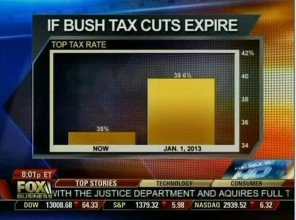

```{r xaringan-themer, include = FALSE}
library(xaringanthemer)
mono_accent(
  base_color = "#43418A",
  text_font_size = "25px",
  text_slide_number_font_size = "0.5em",
  outfile = "xaringan-themer.css"
)
options(htmltools.dir.version = FALSE)
```
```{r setup, include=FALSE}
knitr::opts_chunk$set(fig.height = 4.2, fig.width = 8, dev='svg', message = FALSE)
```

class: center, inverse, middle
# Kas nav kārtībā ar šiem attēliem?

---

## Attēlu avoti

Materiāli ņemti no mājaslapām:

http://www.businessinsider.com/the-27-worst-charts-of-all-time-2013-6?op=1

http://www.biostat.wisc.edu/~kbroman/topten_worstgraphs

http://data.heapanalytics.com/how-to-lie-with-data-visualization

---

## Piemērs 1


.center[]

---

## Piemērs 2
.center[]

---

## Piemērs 3

.center[]

---

## Piemērs 4

.center[]

---

## Piemērs 5

.center[]

---

## Piemērs 6

.center[]

---

## Piemērs 7

.center[]

---

## Piemērs 8

.center[]

---

## Piemērs 9

.center[]

---

## Piemērs 10

.center[]

---

## Piemērs 11

.center[]

---

class: center, middle, inverse

# Kāds ir pats sliktākais attēlu veids zinātnē?

---

## Piemērs 12

.center[]

---

## Kāpēc riņķa diagrammas (pīrāgi, piechart) ir slikti?

* Ir grūti salīdzināt atsevišķas daļas

* Ja iekļauj skaitus/procentus, viena informācija pasniegta vairākas reizes

* Aizņem daudz vietas

---

class: center, middle, inverse

# Kas ir vēl sliktāks par riņķa diagrammu?

---

## Piemērs 13

.center[]

---

class: center, middle, inverse

# Izrādās, ka var arī būt vēl trakāks variants

---

## Piemērs 14

.center[]

.izm50[
Avots: Twitter @pie_says_no
]

---

## Piemērs no Latvijas

.center[]

.izm50[
@dzemdibunams (05.01.2016.)
]

---

## Piemērs no Latvijas (skaidrojums)

.center[]

.izm50[
Avots: @miculis (05.01.2016.)
]

---

## Attēla saturs

* Attēlam ir jāsniedz informācija bez gariem papildus tekstiem

* Tam jābūt skaidram, efektīvam un informatīvam paredzētajai auditorijai

Materiāls ņemts no https://www.ctspedia.org/do/view/CTSpedia/BestPractices

---

## Komunikācija

* Kādu ieskatu šim attēlam ir jāsniedz?

* Vai attēls ir pietiekami intuatīvs?

* Attēlā nedrīkst būt pārāk daudz informācijas, lai nenovērstu uzmanību no galvenās ziņas, ko Jūs vēlējāties sniegt

---

## Informācija

* Maksimalizējiet datu/tintes attiecību

* Katram "tintes" daudzumam ir jābūt nepieciešamam, lai uzsvērtu galveno attēla vēstījumu

* Attēlā nedrīkst likt lietas, kas nav reāli nepieciešamas

---

## Anotācijas (paskaidrojumi)

* Gan leģendu, gan paskaidrojošos tekstus attēlā jānovieto tā, lai tie netraucētu uztvert pārējo informāciju


* Attēlos jāizmanto tāds fontu lielums, kuru var salasīt bez piepūles. Ir jāņem vērā, kur konkrētais attēls tiks izvietots - dokumentā, prezentācijā vai posterī

---

## Asis

* Izmantojiet tādas asu skalas, kas izceļ Jūsu datus - piemēram, novērojumiem laikā, atliekiet laiku uz ass

* Ja veidojat vairākus attēlus, kas vēlāk ir jāsalīdzina, tad visos ir jābūt vienādām asu skalām ar vienādiem intervāliem

* Ja ass nesākas ar 0 vērtību, tad tam ir jābūt skaidri saprotamam. 0 neiekļaušana ir rūpīgi jāizvērtē

* Jāizvērtē asu dalījums (ticks), vai ir nepieciešamas papildus līnijas (gridlines)

---

## Asis

.center[]

---

## Asis

.center[]

---

## Asis

.center[]

.izm50[
Avots: Nils Ušakovs (Facebook)
]

---

## Asis

.center[]

.izm50[
Avots: http://www.datuskola.lv/2017/02/08/datu-apgraizisanai-ne/
]

---

## Stili

* Attēlos jāizvēlas vienkārši un pierasti simboli, apzīmējumi, ko ir viegli atšķirt

* Veidojot attēlus posteriem un prezentācijām, jāizmanto platākas līnijas, lielāki simboli un teksti

* Simbolu un līniju veidu/krāsu nozīmei jābūt vienādiem starp attēliem viena dokumenta ietvaros

---

## Krāsas

* Krāsas attēlos jāizmanto tikai tad, ja tas nepieciešams informācijas pasniegšanai

* Krāsām jābūt kontrastainām un viegli atšķiramām. Jāņem vērā arī tas, ka ir cilvēki ar problēmām uztvert atsevišķas krāsas

* Jāpārliecinās, lai krāsainais attēls skatīts melnbaltā arī ir uztverams

* Visām palīglīnijām ir jābūt savādākām nekā datu līnijām

---
class: center, middle, inverse
# Ko norādīt metodēs?

---
## Metodes

* Jānorāda programma un tās versija, kas izmantota statistisko analīžu veikšanai

* Ja izmanto papildus R paketes, tad jānorāda arī to versija

* Programma NAV statistiskais tests/vai konkrēta metode

* NEPAREIZI: Kā statistisko analīžu metode izmantots R

---
## Atsauce uz R un R paketēm

.izm80[
```{r}
citation()
```
]

---
## Atsauce uz R un R paketēm

.izm80[
```{r}
citation("vegan")
```
]

---
## Metodes

* Metodēs jānorāda pie kāda būtiskuma līmeņa veic visas statistiskās analīzes

* Metodēs vai rezultātos ir jānorāda analīzēs izmantoto novērojumu skaitu

* Jānorāda visi statistiskie testi, kas izmantoti analīzei

---
## Rezultāti

* Raksturojot pazīmes vidējo vērtību, nepieciešams norādīt arī izkliedi raksturojošos rādītājus, piemēram, ticamības intervālu, standartkļūdu vai standartnovirzi (jābūt saprotamam, kas ir norādīts)

* Statistisko testu rezultātos nepietiek tikai ar p-vērtību, bet vēlams norādīt arī papildus rādītājus - t-testam t-vērtību un df, dispersijas analīzei F vērtību, ...

* Vēlams norādīt reālās p-vērtības, piemēram, p=0,035, nevis p<0,05. Ja p-vērtība ir ļoti maza (p<0,0001), tad labāk rakstīt, p < 0,0001, nevis skaitli ar negatīvu pakāpi.

---
## Rezultātu parādīšana

* Meitenēm vidējā atzīmē (8,4, sd=1,3) ir būtiski augstāka nekā zēniem (7,6, sd=1,4), t(44)=2,65, p=0,003

* Vienfaktora dispersijas analīzi izmantoja, lai noskaidrotu koku diametru atšķirības starp trīs mežu augšanas tipiem. Vidējie diametri statistiski būtiski atšķīrās starp augšanas tipiem (F(2,27)=5,77, p=0,008).

---

## Vidējo parādīšana

.center[]

---

## Grupu salīdzinājums

.center[]


---

## Grupu salīdzinājums

.center[]

.izm50[
Avots: http://pagepiccinini.com/2016/02/23/boxplots-vs-barplots/
]

---

## Grupu salīdzinājums

.center[]

.izm50[
Avots: http://pagepiccinini.com/2016/02/23/boxplots-vs-barplots/
]

---

## Grupu salīdzinājums

.center[]

.izm50[
Avots: http://pagepiccinini.com/2016/02/23/boxplots-vs-barplots/
]

---
class: center, inverse, middle
# Kādi būtu jautājumi?