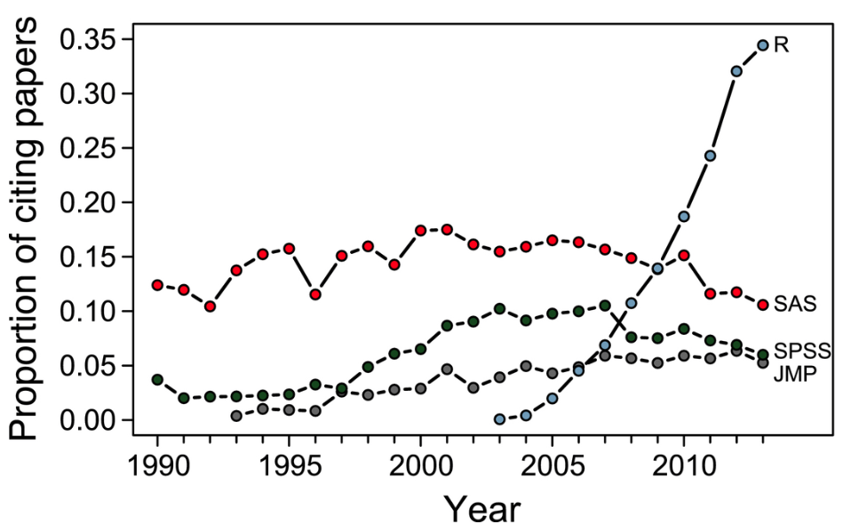
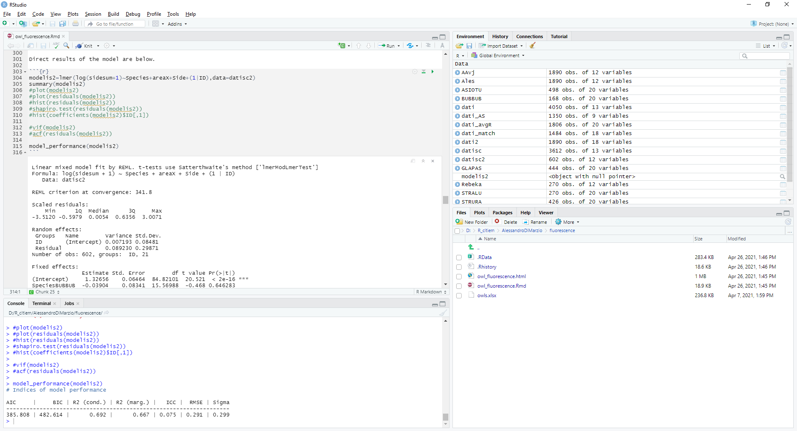

```{r xaringan-themer, include = FALSE}
library(xaringanthemer)
mono_accent(
  base_color = "#43418A",
  text_font_size = "25px",
  text_slide_number_font_size = "0.5em",
  outfile = "xaringan-themer.css"
)
options(htmltools.dir.version = FALSE)
```
```{r setup, include=FALSE}
knitr::opts_chunk$set(fig.height = 4.5, fig.width = 8, dev='svg')
```


## Lekcijas tēmas

- R un RStudio

- Komandu veidošana

- Datu importēšana

- Darbs ar datiem


---
class: center, inverse, middle
# Programma R

---
## R priekšrocības

* Atvērtā koda programma, kas nepārtraukti tiek papildināta un uzlabota

* R var tikt izmantots uz dažādām platformām: Linux, Windows, MacOS

* Lielākā daļa statistisko metožu un aprēķinu ir iekļauts šajā programmā

* Lietotājam ir iespējams kontrolēt visus parametrus veicot aprēķinus

* Ļoti labas grafiskās iespējas, kas ļauj veidot augstas kvalitātes grafikus

* Iespēja veidot pašam savas funkcijas

* Var nodrošināt reproducējamību (reproducibility)

---
## R trūkumi

* Lēns "mācīšanās" temps

* Daļējs trūkums - komandu rindas

* Grūti izsekot līdzi visām papildus paketēm

* Ne vienmēr var ātri atrast nepieciešamo

---
## R popularitāte


.center[]

.izm50[
Avots: http://r4stats.com/2019/04/01/scholarly-datasci-popularity-2019/
]


---
## R popularitāte ekoloģijā

.center[]


.izm50[
Avots: http://onlinelibrary.wiley.com/doi/10.1002/ecs2.1394/full

Touchon, J.C., McCoy, M.W., 2016. The mismatch between current statistical practice and doctoral training in ecology. Ecosphere, 7 (8).
]

---
## Noderīgas mājaslapas programmai un materiāliem

* Programmas R un ar to saistīto materiālu mājaslapa http://www.r-project.org/

* RStudio IDE mājaslapa http://www.rstudio.com

* Blogu apkopojums par R saistītām lietām http://www.r-bloggers.com/

* Video pamācības darbā ar R angļu valodā http://www.twotorials.com/

* Jautājumu un atbilžu lapa Stack overflow http://stackoverflow.com/

* Jautājumu un atbilžu lapa Stack exchange https://stats.stackexchange.com/

* Meklēšanas rīks visās R paketēs http://www.rdocumentation.org/

---
class: center, inverse, middle
# RStudio IDE

---
## RStudio IDE


.center[]

.izm80[
* File -> New File -> R Script

* File -> Save with Encoding -> UTF-8 vai windows-1257
]

---
## Komandu veidošana


* Lai komandu rindai pievienotu komentāru, pirms tā ir jāraksta “#”

* Atstarpes komandās parasti tiek ignorētas, izņēmums ir rakstot “<-”

* Formāli ievietošanai izmanto "<-", bet vairumā gadījumu tiks atbalstīts "="

* Komandas argumentus atdala ","

* Ja komanda ir pārāk gara, tad to var sadalīt vienkārši ar Enter taustiņu

* Iztrūkstošās vērtības programmā R apzīmē ar `NA`

* Decimālatdalītājs ir punkts "."

---
## R paketes

* Bāzes R programmā ir tikai neliela daļa no iespējām, ko piedāvā R

* Papildus iespējas (funkcijas) pieejamas kā paketes (library), kuras no sākuma jāuzinstalē (ja tas jau nav izdarīts) un tad jāpievieno (tas jādara katrā sesijā)

* Pakešu instalācija notiek ar funkciju `install.packages()`, drošības labad - papildarguments `dependencies=TRUE`

```{r,eval=FALSE}
install.packages("ggplot2",dependencies=TRUE)
```

* Pievienošana darba sesijai ar funkciju `library()`.

```{r,eval=FALSE}
library(ggplot2)
```


---
## Palīdzības iegūšana


```{r eval=FALSE}
help(plot) # meklē pēc pilna nosaukuma aktīvajās paketēs
?plot # ekvivalents help()
??plot # meklē visās pieejamajās paketēs pēc nosaukuma daļas
```
```{r eval=FALSE}
example(plot)
```

Mājaslapā:

http://www.rdocumentation.org/

Jāiemācās jautāt, bet vislabāk palīdz:

http://www.google.com/

---
## R kā kalkulators

R var tikt izmantots kā vienkāršs kalkulators
```{r}
4+7
log(8,2)
exp(2)
```


---
## Datu veidi


* Skaitliski (numeric, double, integer), piemēram, 1, 5, 2.6, -123.45

* Rakstu zīmes (character), piemēram, 0+, zils, diabēts

* Kategoriski (factor): datu bāzē apzīmēti ar skaitli, kam ir teksta apzīmējums

* Kategoriski ordināli (ordered factor): skaitļu secībai datubāzē ir nozīme

* Loģiski (logical) - TRUE un FALSE


---
## Galvenās datu struktūras

* Vektors (vector)

* Matrice (matrix)

* Saraksts (list)

* Datu tabula (data frame)

---
## Datu importēšana

* Bāzes R piedāvā iespējas importēt .txt, .csv un citus ASCI tipas datus

* Izmantojot papildus paketes iespējams importēt ļoti daudzus citus datu formātus - Excel, SPSS, SAS, json, utt

* Importējto datus, jānorāda pilnais ceļš uz datu failu

* Garo saiti uz failu var nerakstīt, ja fails atrodas darba direktorijā (Working directory)
(RStudio var nomainīt ar `Session/Set Working Directory`)


---
## Darba direktorija


Pēc noklusējuma R meklē/saglabā failus darba direktorijā.

```{r,warning=FALSE,message=FALSE}
getwd()

setwd("D:/Biometrija_AAvj")

getwd()
```


---
## Datu importēšana - Excel faili

Excel failu importēšanai var izmantot paketes `readxl` funkciju `read_excel()`. Funkcijā var norādīt gan importējamo lapaspusi, gan importēt tikai daļu tabulas. Funkcija automātiski spēj noteikt kolonnu tipus (tai skaitā arī datumus).
.izm90[
```{r, eval=FALSE}
library(readxl)
dati <- read_excel("niedres.xlsx")
dati
```
```{r,echo=FALSE}
library(readxl)
dati <- read_excel("../Dati/niedres.xlsx")
dati
```
]

---
## Datu importēšana - iebūvētie dati

Programmā R ir iekļauti dati, kuru nosaukumus un aprakstus var apskatīt ar funkciju `data()`.

```{r eval=FALSE}
data()
```


---
## Datu importēšana - iebūvētie dati

Ar funkciju `data()` un norādot objekta nosaukumu var importēt iebūvētos datus (bet šādi neimportē savus failus).


```{r}
data(cars, package = "datasets")
head(cars)
```

---
## Datu struktūra

Vienmēr pēc datu importēšanas, ir ieteicams apskatīties uz to struktūru ar funkciju `str()`.

```{r}
str(dati)
```

---
## Kolonnu nosaukumi

Ar funkciju `names()` var pārbaudīt kādi ir kolonnu nosaukumi datu tabulai.

```{r}
names(dati)
```

---
## Datu apskatīšana

Ar funkcijām `head()` un `tail()` var apskatīt attiecīgi pirmās sešas vai pēdējās sešas rindiņas. Ja pievieno argumentu `n=`, tad var mainīt attēlojamo rindiņu skaitu.

```{r}
head(dati)
```

---
## Datu apskatīšana

Ja funkcijām `head()` un `tail()` pievieno argumentu `n =`, tad var mainīt attēlojamo rindiņu skaitu.

```{r}
tail(dati, n = 2)
```

---
## Datu atlasīšana 

Tā kā matricai un datu tabulai ir divas dimensijas, tad atlasīšanai jāizmanto divas pozīcijas - pirmā ir rindas numurs, otrā ir kolonnas numurs.

Atlasa otro rindu un otro kolonnu.

```{r}
dati[2,2]
```

---
## Datu atlasīšana 

.izm90[
Atlasa pirmo rindu.

```{r}
dati[1,]
```

Atlasa otro kolonnu.

```{r}
dati[,2]
```
]

---
## Datu atlasīšana

Datu tabulā kolonnas var atlasīt arī pēc nosaukuma.

```{r}
dati$garums
dati["garums"]
```

---
## Darbs ar datiem

```{r eval=FALSE}
garums
```
```{r eval=FALSE}
Error: object 'garums' not found
```

Programmā R datu tabulu kolonnas automātiski netiek uzskatītas par atsevišķiem mainīgiem


---
## Datu atlasīšana

Ja ir nepieciešams atlasīt uzreiz vairākas rindas vai kolonnas, tad jānorāda kārtas numuri (vai nosaukumi) kopā apvienoti ar funkciju `c()`, vai arī izmantojot `:`, ja jāizvēlas intervāls.

```{r}
dati[c(4,6,8),]
```

Funkcija `seq()` ļauj izveidot vērtību vektoru intervālā no - līdz ar noteiktu vērtību soli.

```{r,eval=FALSE}
dati[seq(from=4,to=8,by=2),]
```

---
## Objektu veidošana

Ja kādas darbības rezultātu (analīzes, atlasīšanas, importēšanas, utt) nepieciešams saglabāt, tad sākumā raksta vēlamo objekta nosaukumu, tad `<-` un tad veicamo darbību

```{r}
dati2 <- dati[2,]
dati2
```


---
## Vektors

Viendimensionāla datu struktūra, kas var saturēt tikai viena tipa datus: skaitļus, loģiskos datus vai rakstu zīmes

```{r}
pirmais <- c(1,5,7,4,8,10)

pirmais

otrais <- c("A","B","C","D","E","F")

otrais
```


---
## Matrice

* Tai ir divas dimensijas, bet var saturēt tikai viena tipa datus
* Matricu var izveidot ar funkcijām `cbind()`, `rbind()` vai `matrix()`

```{r}
tresais <- matrix(1:15,ncol=3)

tresais
```

---
## Datu tabula

Divdimensionāla datu struktūra, kas var saturēt dažāda tipa datus
atsevišķās kolonnās (visām kolonnām jābūt viena garuma)

```{r}
septitais <- data.frame(kol1 = c(1,2,3,4), kol2 = c(5,6,7,8))

septitais

```

---
## Datu atlasīšana - vektors

Datu atlasīšanu veic izmantojot kvadrātiskās iekavas. Pozitīvs indekss nozīmē elementu, kas jāatlasa, negatīvs - kuru vērtību nevajag atlasīt. 

```{r}
otrais[1]
otrais[c(1,4)]
otrais[-3]
```


---
## Datu atlasīšana - vērtības

.izm80[
Kvadrātisko iekavu pierakstu ir iespējams izmantot arī atlasei pēc vērtībām

```{r}
dati1 <- dati[dati$platums>=4,]
# atlasa rindas, kurās lauka "platums" vērtības ir lielākas vai vienādas ar 4
head(dati1,2)
```

Alternatīva - funkcija *subset()*, kurā kā argumentus norāda datu objektu un kolonnu, kurā veikt atlasi

```{r}
dati2 <- subset(dati,platums>=4)
head(dati2,2)
```
]

---
## Biežākie operatori

- saskaitīt +
- atņemt -
- reizināt *
- dalīt /
- kāpināt ^
- vienāds ar ==
- lielāks par >
- mazāks vai vienāds <=
- un &
- vai |
- nav vienāds ar !=
- satur %in%
- daļas objekta iekšienē - aiz dolāra zīmes $


---
## Jaunu kolonnu veidošana

Izveidojam un aizpildam četrus jaunus laukus objektā dati:

.izm80[
- Aprēķinam laukumu:
```{r}
dati$laukums <- dati$garums*dati$platums
```

- Izveidojam divas izmēru grupas

```{r}
dati$grupas1 <- ifelse(dati$laukums<=150, # kritērijs
                       "mazs", # vērtība, ja kritērijs izpildās
                       "liels") # vērtība, ja neizpildās
```

- Definējam tās kā kategoriju mainīgo

```{r}
dati$grupas2 <- factor(dati$grupas1)
```


- Norādam, ka kategorijām ir dabiskā secība

```{r}
dati$grupas3 <- factor(dati$grupas1,
                       ordered=TRUE, # secībai ir nozīme
                       levels=c("mazs","liels")) # secība ir šāda
```
]

---
## Jaunu kolonnu veidošana - rezultāts

```{r}
str(dati)
head(dati,5)
```

---
class: center, inverse, middle
# Kādi būtu jautājumi?
